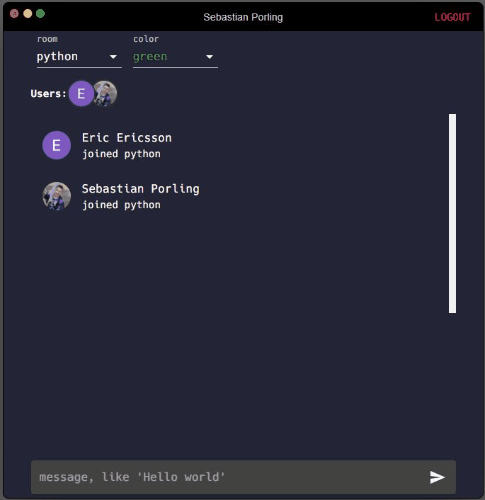

# react-chat

This solution is made by [Sebastian Porling](https://github.org/sebastian-porling).

## :heavy_check_mark: Demo

## :boom: Compile, execute and build

The project is available on [https://react-chat-sp.herokuapp.com/](https://react-chat-sp.herokuapp.com/). You will not be able to compile and execute this project on your computer as I use firebase, which is something toy have to setup in order to run this project.

### :arrow_forward: Frontend

I have been using react for the frontend utilizing material.ui for styling.
I use firebase for the frontend to handle the login and getting the JWT token which is sent to the backend for authorization.

| class             | functionality                                                                                                     |
| ----------------- | ----------------------------------------------------------------------------------------------------------------- |
| colors            | just static colors used in the application                                                                        |
| init-firebase     | Initializes the firebase application                                                                              |
| UserProvider      | Using the react context to provide user and socket states. Registers a listener on the user object using firebase |
| authService       | Have functions for signin and signout, also adds default color to firebase database                               |
| socketService     | Have functions for emitting to the server socket, as well setting up a client socket                              |
| StartPage         | Displays welcome message and login button                                                                         |
| LoginButton       | Signs in using a google popup using firebase                                                                      |
| ChatPage          | Displays the chat, chatform, color switcher, room switcher and room users                                         |
| Chat              | Displays all messages                                                                                             |
| ChatMessage       | Displays a message and user info                                                                                  |
| ChatForm          | A form for submitting messages                                                                                    |
| RoomSwitcher      | Select for changing chat room                                                                                     |
| RoomUsers         | Displays all users in the chat room                                                                               |
| UserColorSelector | Select for changing message color                                                                                 |
| LogoutButton      | Signs out using firebase                                                                                          |

### :arrow_backward: Backend

I used Node.js, express and Socket.io for the backend.
I create multiple handlers and take care of authentication before the conenction with the socket has been sstablished.
I use Firebase for checking the JWT token.

| endpoint   | functionality                         | comments                                                  |
| ---------- | ------------------------------------- | --------------------------------------------------------- |
| join       | Adds user to given chatroom name      | If room exists we add it using the ChatroomHandler        |
| leave      | Removes user from given chatroom name | If room exists we remove the user from the room           |
| message    | Broadcasts message in chatroom        | If room exists we will broadcast the message to that room |
| chat rooms | Returns all chatroom names            | ----                                                      |
| users      | Returns all logged in users           | Empty array if no users                                   |
| disconnect | Handles disconnect on socket          | Removes the user from ClientHandler and all chat rooms    |
| error      | All errors handled here               | If something would go wrong                               |

| class                     | functionality                                        |
| ------------------------- | ---------------------------------------------------- |
| server                    | Sets up the express/http server and adds the sockets |
| socket                    | Sets up authentication and handlers for endpoints    |
| fireBaseJwtAuthentication | Authenticates the JWT token with firebase            |
| firebaseAdmin             | Initializes the firebase admin app                   |
| ChatHandlers              | Handles all functionality of the socket              |
| Chatroom                  | Represents a chatroom with users and chat history    |
| ChatroomManager           | Handles all chat rooms                               |
| ClientManager             | Handles all client sockets                           |
